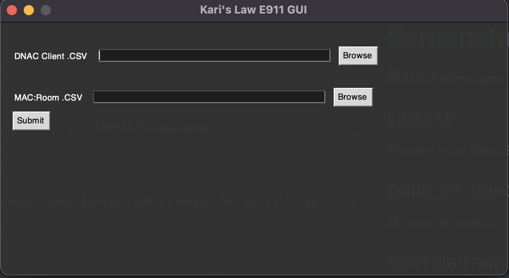
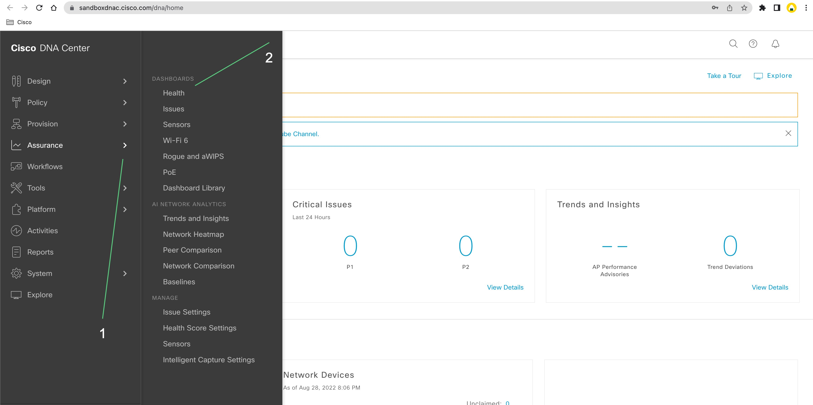
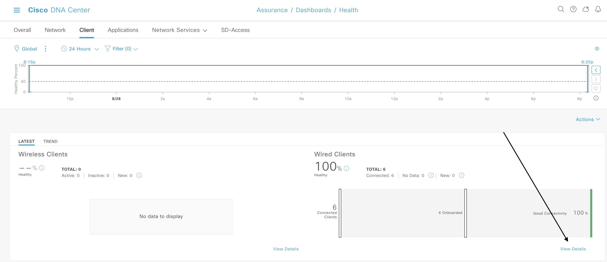
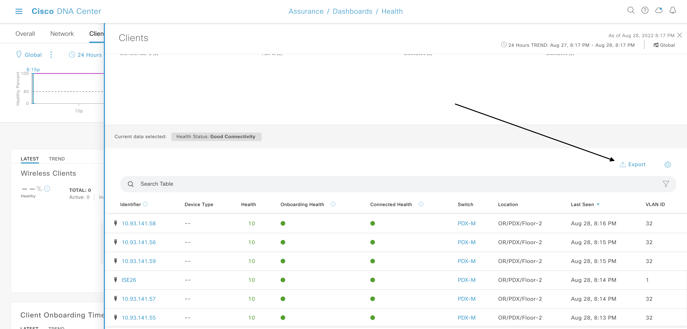

# Kari's Law automation with Cisco DNA Center.
### For compliance with new E911, this script automates the collection, application configuration, and deployment of Kari's Law info via LLDP Civic-Location configuration.

### Contacts
* Charles Llewellyn (chllewel)
*  Nick Sischo (nsischo)

## Solution Components
* Python 3.10.X or later.
* DNAC 2.3.2 API Bundle Enabled on Remote
* This Scripted tool
* Input #1 : DNAC 2.3.2 Device Wired Client Health .CSV Report.
* Input #2 : MAC to Room Address Mapping following the approved template.

## Related Environment
This script uses a pre-existing Cisco DNA Center instance, reachable by the local process running this script. 
As long as the provided DNAC instance can be connected to via the supplied details in config.ini, then that is acceptable. 
* This version of the script uses DNAC Release 17.X. 
* This version of the script uses DNAC API bundle 2.3.3.


## Installation/Configuration
Download or clone this project repo into an appropriate place to run the process. 
The following is provided as the installation instructions.

First, navigate to the intended file destination in your local file system, and assure that you have python installed
and reachable in your chosen terminal client. 

Next, use the following commands to prepare the environment.
```
git clone https://github.com/gve-sw/gve_devnet_dnac_e911.git
```
Wait for the project to download. Once completed, ensure you navigate into the top level directory, gve_devnet_dnac_e911.
```
cd gve_devnet_dnac_e911
```
Next,
```
pip install -r requirements.txt
```

Finally, locate the [CONFIG FILE](./resources/config.ini) in the resources folder, and add your own information to it.
```
[DNAC]
URL = https://<IP ADDRESS or DNS Address OF DNAC>
USERNAME = <USERNAME>
PASSWORD = <PASSWORD>
```
Once the installation of requirements is complete, you may use the tool.

## Usage

Once the environment is prepared, and all requirements installed with no errors, you may interact with the script.
From CLI:


    $: python GUI.py


You will see a small window appear on screen:



This is where you will supply the required inputs.
The first input, "DNAC Client .CSV" is an auto-generated output from DNAC's Client Health service.
The second input required is an indexed MAC:Room Number mapping that must follow the provided template.

## Required Inputs
In order for this script to work properly, you must provide it with the required inputs in the required format. 
Otherwise, errors will occur. We highly reccommend that you provide the inputs according to the standard. 

First, let's collect input #1:
### DNAC Assurance Wired Client Health Report
Begin by logging in to your DNAC instance.

From the homescreen, open the side menu, and navigate to the "Assurance" tab.
Next, click the 'HEALTH' option in the sub-menu that opens.


Once the Health Page has loaded, select the 'CLIENT' tab at the top of the screen.
Next, scroll until you see the client trend page. From here, select 'View Details' on the WIRED CLIENT SIDE.

#### This is critically important, as only wired clients can be reliably assumedto be useful input for this script. 



Finally, once the side panel has opened, click to export the Client Info as a .CSV file.

#### This is your DNAC Input #1 - The first of two required inputs for this script.

## Mac :: Room # Mapping.
The second input that must be aquired for this script is a MAC ADDRESS to Room number mapping (one to one). 
This effort must be conducted over a short period of time to minimize drift, as this script is used as a 
"moment in time" configuration tool. Variance in Mac :: Room Number between collection of the data and running this script successfully will lead to incorrect information being configured. 
The .csv template is provided in the: 

[TEMPLATE FOLDER](./Templates/EXAMPLE_MAC.csv)

Once this input has been aquired, and cleaned to match the appropriate 
template, these inputs can be provided to the GUI as input #1 (DNAC) and input #2 (MAC:ROOM) appropriately.
Once both have been selected using the file selector, and are accessible (Read) to the tool, you may click submit, to run the script. 


### LICENSE

Provided under Cisco Sample Code License, for details see [LICENSE](LICENSE.md)

### CODE_OF_CONDUCT

Our code of conduct is available [here](CODE_OF_CONDUCT.md)

### CONTRIBUTING

See our contributing guidelines [here](CONTRIBUTING.md)

#### DISCLAIMER:
<b>Please note:</b> This script is meant for demo purposes only. All tools/ scripts in this repo are released for use "AS IS" without any warranties of any kind, including, but not limited to their installation, use, or performance. Any use of these scripts and tools is at your own risk. There is no guarantee that they have been through thorough testing in a comparable environment and we are not responsible for any damage or data loss incurred with their use.
You are responsible for reviewing and testing any scripts you run thoroughly before use in any non-testing environment.
